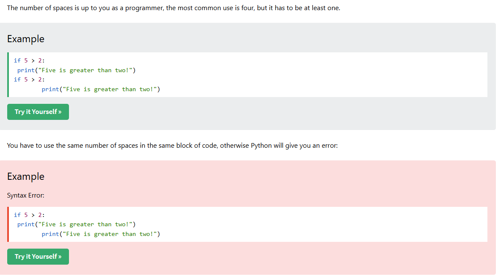

Python runs on an interpretor System, meaning that the code will be executed as soon as it is written 
(you don't have to compile it like in C++)

Python can be treated in a procedural way, an object oriented way or a functional way

Python uses indentation to define the scope of the loops, functions and clases. Other programming languages often uses the curly brackets

Indentation: spaces, number of spaces will be to the developer and the most common is four spaces

.py is the extension for pyhton files

To run a file -  go to the directory and "python filename"

To run python in command line - "python", "exit()"

#Python Statements
In python a statement usually ends when the line ends, you don't need a semicolon but can be used (rare)
You can write multiple statements in one line using semi colon
Eg:  print("A");print("B");print("C")   -- correct
Eg:  print("A") print("B")  --wrong

#Python Output
print() function - each call prints text in the new line by default
can have double or single quotes

print("Hello World", end = "") 
print("Hey")
O/P: Hello World Hey    
end parameter will print the words in the same line, and you can give anything with end parameter

print(3) - numbers, no need of single or double quotes
print(3+1) - you can also do math inside
print("I am ", 35, "years old") - comma will give me the spaces

#Python Comments
hash - for single line comments
"""" - triple quotes for multiline comments

#Python Variables
A variable is created the moment you assign a value to it
A variable is not declared with any particular type and can also changes after being set
x = 3
x = "Kushal"
print(x) - Kushal

Casting: If you want to specify the data type of a variable then it can be done
x = int(3) //x will be 3
y = str(3) //y will be "3"
z = float(3) //z =3.0

type(x) - to get the type of the variable

Rules of naming a variable
start with letter or an underscore and cannot with numbers
it can contain alphanumeric characters [A-Z,a-z, 0-9, _]
variable names are case sensitive: a, A both are different
it cannot be a python keyword

Mult Word variables
myPython - Camel Case
MyPythonHii - Pascal Case
my_python_hii - Snake Case

Multple Values
x,y,z = "A", "B", "C"
x=y=z = "A" //one value to all
Unpacking lists and tuple
fruits = ["a","b","c"]
x,y,z = fruits

